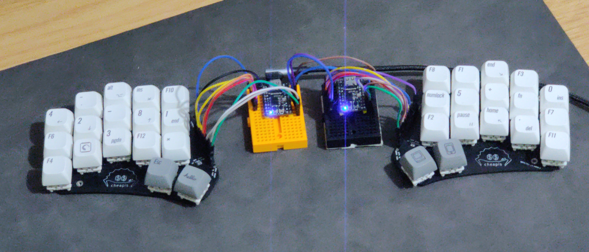

**Level: Intermediate 😅**

This is what I use for development!

Check out dotleon's cheapis here: https://github.com/dotleon/cheapis

- This is an example of a true split keyboard. That is, there are two MCUs and not just a matrix carried over to the other side (e.g., [Cheapino](https://github.com/tompi/cheapino), not be confused with Cheapis).
- The base layout is parameterized (as a string! `QWERTYUI..`) and can be easily swapped.
- The hold-tap behavior for the key that activates the media layer is automatically generated based on the contents of the media layer itself, so that the key would act as a hold only if the next pressed key is a non-empty keycode (`XXXX`). This avoids unnecessarily activating the media layer if the next pressed key would be useless anyway.
- Home-row mod behaviors are automatically generated, allowing for bilateral combinations and combining more than one mod. The `eager_decision` property is set to `'hold` for all mods except `lalt`, which allows for Gui/Ctrl/Shift + external mouse click, without having to wait for the timeout. For operating systems that react to Gui being tapped (like Windows), you might want to exclude `lgui` from `eager_decision` assignment too. My OS doesn't react to Gui tap so I'm cool with it.
